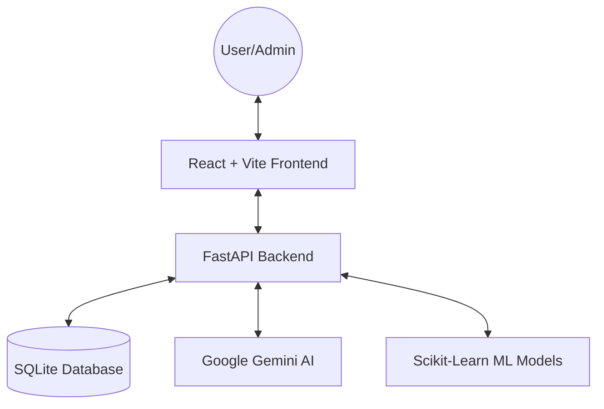

# AI-Driven E-Commerce & Inventory Management System (AI-BOS)

[](https://fastapi.tiangolo.com/)
[](https://reactjs.org/)
[](https://www.docker.com/)
[](https://www.sqlite.org/)
[](https://scikit-learn.org/)

An enterprise-grade, high-performance E-Commerce platform integrated with advanced AI capabilities for real-time customer support and predictive inventory analytics.

---

## 🏗️ System Architecture



---

## 🚀 Key Features

### 🤖 1. Intelligent AI Chatbot
A 24/7 conversational assistant designed to enhance user engagement.
*   **Engine**: Google Gemini Pro API integration.
*   **Memory**: Multi-turn conversation history persistence.
*   **Management**: End-user ability to delete or clear chat history.
*   **UI/UX**: Smooth glassmorphism widget with real-time streaming-like feedback.

### 📊 2. Machine Learning Demand Forecasting
A state-of-the-art forecasting suite for data-driven inventory management.
*   **Dual-Model Architecture**: Simultaneous training of **Linear Regression** and **Random Forest Regressor**.
*   **Champion Selection**: Automated model selection based on lowest **RMSE** and **MAE**.
*   **Feature Engineering**: 7/14/30-day lag analysis, rolling temporal statistics, and growth realistic filters.

### 🚨 3. Smart Inventory Orchestration
*   **Stockout Prediction**: Dynamic calculation of "Days Until Stockout" based on ML trends.
*   **Automated Reordering**: AI-suggested quantities to meet the next 30 days of demand.
*   **Tiered Visual Alerts**: Critical (red), Warning (yellow), and Info (blue) status tracking.

---

## 🐳 Quick Start (Docker)

The easiest way to run the entire suite locally:

1. **Clone & Navigate**:
   ```bash
   git clone https://github.com/HaseebAhmad24-collab/AI-Driven-Ecommerce-Suite.git
   cd AI-Driven-Ecommerce-Suite
   ```

2. **Secrets Configuration**:
   Create `backend/.env`:
   ```env
   GEMINI_API_KEY=your_key_here
   ```

3. **Launch**:
   ```bash
   docker-compose up --build
   ```
   *   Frontend: `http://localhost:5173`
   *   API Docs: `http://localhost:8000/docs`

---

## 🛠️ Project Structure

```text
AI-BOS/
├── backend/              # FastAPI Server & ML Models
│   ├── main.py           # API Entry Point
│   ├── forecasting.py    # ML Logic (LR & Random Forest)
│   ├── chatbot.py        # Gemini AI Orchestration
│   └── models.py         # SQLAlchemy Models
├── frontend/             # React (Vite) Application
│   ├── src/              # Source Code
│   ├── public/           # Static Assets
│   └── index.html
├── docker-compose.yml    # Root Orchestration
└── .gitignore            # Clean Repo Configuration
```

---

## 👨‍💻 Manual Development Setup

### Backend
```bash
cd backend
python -m venv venv
source venv/bin/scripts/activate  # On Windows: .\venv\Scripts\activate
pip install -r requirements.txt
uvicorn main:app --reload
```

### Frontend
```bash
cd frontend
npm install
npm run dev
```

---

**Developed with focus on Scalability, Accuracy, and User Experience.**
